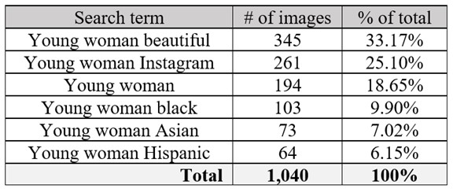
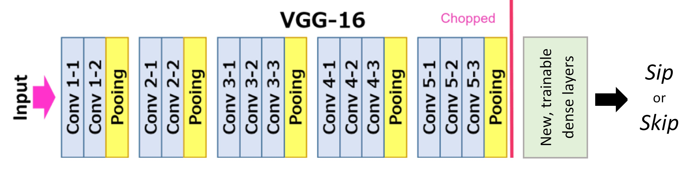
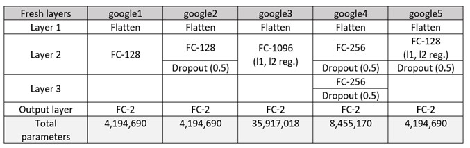

# Cafe: Predicting Physical Attractiveness with Deep Learning-Based Systems

## Abstract
The modern dating scene has been transformed by digital technologies. With the rise of social media apps such as Tinder and Bumble, finding a potential partner has never been so convenient. Can the process of finding a match be further digitized with deep learning techniques? This study explores the viability of using convolutional neural networks to create personalized matchmaking algorithms. Using transfer learning techniques, five architectures were appended to VGGNet, and trained on photos scraped from Google Images. Most networks were able to achieve an accuracy between 74% and 76%, competing with even the best wingman. This study also investigates how such models would perform on multiple images of a single person, which is intended to represent a dating profile. Most architectures exhibited reliable results, consistently giving the same label to four out of five images of a specific individual. Lastly, this paper explores the explainability of such models.

## Introduction
The way in which lovers are finding each other is, like all other domains, adapting to the wide-spread availability of technology. Popular dating apps such as Tinder, Bumble, and Plenty of Fish, among others, have amassed an estimated 30.4 million users in the United States and are expected to have 35.4 million users by 2024 [24]. The lure of these apps is that one can gain exposure to many potential partners quickly and conveniently. All a user must do is upload images of his- or herself, fill in some personal details, and explore. Most sites create a “match” if both users elect (anonymously) that they “like” the other user. This matching then enables the two users to communicate with each other and explore a potential relationship.

The efficacy of such apps for finding a long-term partner has been questioned by some; Bauman (2003) argues that the convenience of finding a partner undermines the principles of romance and courtship [3]. On mobile apps, the ease-of-use has made it easy to rapidly *swipe* (“like” or “dislike”) on others; Levy et al. (2019) found that male users spend 6.7 s evaluating a profile and female users spend 11.1 s [15]. Subtracted from this is the time required for face recognition, emotion awareness, and attraction preferences, which studies have found require 1 – 5 s for a person to process [28, 29, 30, 32]. This means online daters are spending only a few seconds making their decision. 

Researchers have found that physical attractiveness is often the most important contributor when forming an impression of a potential partner [19]. However, Kniffin and Wilson (2004) found that non-physical features that were learned only after interacting with others played a significant role in one’s attractiveness; a person’s initial assessment of someone’s physical attractiveness was different after obtaining further impressions through group activities. On dating apps, however, these personality traits are largely unavailable, save for self-reported characteristics in one’s bio. As evidenced by Levy et al. (2019), most swiping decisions are made in just enough time to process a user’s physical appearance.

### Motivation and problem statement
With the number of online singles growing, a person can get lost viewing profiles for many hours, never finding a single match. Waiting for your profile to be shown to others (and liked) can take time as well. On Tinder, a user can even be shown profiles they have already disliked as the pool of unviewed profiles dries up [27]. It has also been claimed that Tinder displays users that have already swiped left on you, in which case swiping on those profiles are meaningless. By increasing the volume and availability of prospective partners, these apps have also added an unintended inefficiency to this process. These undesirable app features, however, may be aimed more at maintaining a user base and following a business model than at efficient matchmaking.

To reduce wasted time, we propose using Deep Learning and transfer learning methods to automatically classify profiles for a given user. By training a personal algorithm, all matching would be done instantly (or in the required computational time to predict all profiles in the user-base) upon signing up for the service. Similar business models have been seen in social media apps such as Facebook, Instagram, and Twitter. Most recently, TikTok has exploited a prediction-based AI recommendation system for content feeds to foster substantial user-engagement rates. This is a large reason the average user spends 52 minutes per day on the app and the value of their parent company, ByteDance, grew to $75 million in November 2018 [7]. 

This study aims to provide a proof-of-concept for the idea and to define a model architecture that can be used generally to solve this task. Specifically, the model architecture was trained to predict physical attractiveness of a woman’s face according to the author’s personal preferences.

### Related works

Brozovsky and Petricek (2007) suggested collaborative filtering (CF) algorithms as an improvement on global algorithms [5]. These user-specific functions were better at producing a list of 10 profile recommendations for individuals that initially rated 150 profiles. Krzywicki et al. (2014) notes that standard profile matching algorithms are susceptible to “over-recommending” popular profiles [14]; this underscores the issue with a greedy approach used in certain online dating services. The study also found that including an additional rating system based on important user-specific features improved the success rate of real-life interactions.

Approaches using instance-based learning on user-specified features (eye color, hair color, age, hobbies, etc.) was found to have positive results as the user labeled increasing amounts of data [17]. Joel et al. (2017) used random forests on user-specified features to predict desire among individuals [10]. The results suggested that relationship science can meaningfully estimate people’s tendencies to desire others in general, but not to desire a single person in particular over others. That is, the distinction between predicting general attractiveness and unique allure requires different methodology.

Transfer learning techniques have been used to approach this classification problem. Vries and Yosinski (2015) compared the fine-tuned performance on two different pretrained models to classify attractiveness [31]. The first model was inspired by VGGNet [23] with fine-tuning layers added to the end. The second model was a similar convolutional neural network that was pre-trained on gender classification before fine-tuning. The VGGNet outperformed the gender classifier when classifying the attractiveness of 9,364 Tinder profile pictures. The fine-tuned VGGNet model obtained a 68.1% accuracy on the test set and performed subjectively well. The study also estimated the difficulty level of this task. After one week, the author who originally labeled the images according to his own personal preferences re-labeled a random sample of 100 images; this timeframe was chosen so the author would not remember or recognize any faces. Despite using his own preferences, he was only able to attain an 88% accuracy on the sample. The authors estimate from this that roughly 24% of images are not consistently labeled by humans, with approximately 12% defining a lower-bound on any error rates sought after for this task.

Though its underlying algorithm techniques are not publicly known, *iris* is a new dating app that claims to use artificial intelligence to learn what type of person a user finds visually attractive [9]. Dubbed “AttractionDNA”, the company implements a seemingly commercialized solution to the task this study will focus on.

To uncover the mystery behind how neural networks arrive at their outputs, Layer-wise Relevance Propagation was proposed as an improvement to sensitivity analysis [22]. This technique decomposes the learned function, assigning relevance to more active neurons and stronger edges. This propagates backwards to the input layer, at which point all input features (pixels, in this case) are given a *relevance score*. This score can be positive, meaning it helped support the final classification, or negative, meaning it contradicted the decision. The magnitude of these scores is proportional to the expected importance of the input values.

## Methods and data
The example task is to predict whether the author, a 20-year-old white male, would classify a photo of a woman to be pretty or not. The profiles this type of user would be exposed to include women between the ages of 18 and 25 (approximately) of all races, with perhaps a larger proportion of white women than other ethnicities.

## Google Images data
The first set of data used in this study was a collection of 1,040 representative images of young women that were scraped from Google. These images were used to train a model to predict preferences for potential partners. 

### Data acquisition
No adequately large collection of representative and labeled images could be found for our objective, so we constructed our own training set. 2,887 images were scraped from Google Images using defined search queries [21]. By entering the query term "young woman" into Google search, a fairly representative selection of images that a user would find on a dating app were returned. However, this yielded a disproportionately large number of white women, and very few images of minorities. To create a more diverse dataset (which is important for producing a robust and unbiased model), the search terms "young woman black", "young woman Hispanic", and "young woman Asian" were added.
Many of the scraped images contained a watermark that obstructed part or all of the face. This is problematic because a model may inadvertently "learn" the watermark as an indicative feature. In practical applications, the images fed into the model will not have watermarks. To avoid any issues, these images were not included in the final dataset. Other images were discarded for being irrelevant (animated pictures, logos, men) that were able to seep through the Google Search criteria. Roughly 59.6% of images were thrown out because there was a watermark overlayed on the face or they were irrelevant. This drastically reduced the number of images available, so the search term "young woman Instagram" was added. These photos were all very representative of what a profile picture might look like on a dating app.

After labeling these images, the resulting dataset contained a far larger number of *skip* (dislike) images than *sip* (like): 419 vs 276. To create an unbiased model, we wanted to use a balanced dataset. Therefore, the size of the dataset was limited to 276 observations of each class (before splitting into a training and validation set). This is not many observations. To artificially inflate the number of *sip* images available, the search term "young woman beautiful" was added. The new counts were 646 *skip* and 520 *sip* images. After balancing, the dataset is nearly double its previous size, a considerably larger set for training a model.

### Data augmentation / preprocessing
The images were displayed to the author without any augmentation or processing applied; the full, original image was classified as either sip or skip. Once labeled, the image was cropped to include only the face of the subject, identified using MTCNN [33] as implemented by Brownlee (2019) [4]. The cropped image is a different shape for each image, which is not appropriate for inputs to a neural network. As a workaround, the larger dimension was resized to 256 pixels, and the smaller dimension was scaled such that the aspect ratio was maintained. The smaller dimension was then padded with black pixels on both sides to a size of 256. The result was a 256x256 pixel image. A subset of the cropped images is displayed in Figure 1.

*Figure 1: Example images scraped from Google Images. This display is after photos have been cropped and padded.*

When preparing training batches, the standard preprocessing for the VGG network was applied to all images [26]. This includes converting all images from RGB to BGR and zero-centering each color channel with respect to the ImageNet dataset (without scaling). Only one of the models (google1) did not apply this preprocessing when training.

To increase the number of training images available, transformations were also applied to the images when preparing training batches. The transformations included random rotation (up to 30 degrees), zoom (up to 15%), shift (up to 20% horizontally and vertically), and shear (up to 15%). This allows us to artificially inflate the size of our dataset when training.

### Data summary
The final dataset contains 1,040 images (520 of each class). Table 1 shows the composition of this dataset based on the query terms entered into Google Search.

*Table 1: Breakdown of the scraped images dataset by search term.*

Notably, 23.07% of the total images are exclusively of minority women. This value is actually higher, as the search terms, “young woman”, “young woman beautiful”, and “young woman Instagram” may contain minorities as well. Generally, though, those groups were of mostly white women. 

The data was separated into a training and validation set by a random 80-20 split. 

### Data limitations
There is a significant gap in the proportion of minorities represented in the different classes. Minority women comprised 36.73% of all skip images, but only 9.42% of the *sip* images. This difference is nearly four-fold. It is important to note that this disparity may bias the inherent attractiveness of women of color, though any partiality will be inherently correlated with the preference of the author.

Furthermore, the training set was composed of images that would best represent the potential partners for a 20-year-old white male. Any results obtained using this dataset may not carry over to images containing men, older demographics, or more racially diverse groups.

Additionally, the images contain padded walls to ensure all images are the same shape. While this preserves the original proportions of the face, it introduces unrelated features that may be learned by a model. The paddings do not inherently add physical attractiveness to a person.
Lastly, a large bias was introduced by the way training images were labeled. To best simulate the environment of a dating app, the author was shown full, original images one-by-one and asked to classify each as either *sip* (like) or *skip* (dislike). The labels referred to the physical attractiveness of the entire image, with the assumption that an attractive person exhibits an attractive face. This premise is not entirely veristic, as there are other, non-facial features (body shape, clothing, pose, etc.) visible in the unaltered images that may have contributed to the evaluation of their attractiveness. While focusing on the face provides a convenient way to isolate the subject, it must be noted that the data has built-in inaccuracies to consider.

## Friends dataset

In addition to the 1,040 images scraped from Google Search, a second collection included a set of five images for each of 14 participants of the appropriate target group (18-25-year-old women). The images were not labeled by the author, but used as a subjective benchmark on real images, as well as to test for within-group variation in model predictions. In a practical environment, dating app-goers typically upload multiple images of themselves, but prospective matches can only give a single evaluation— “like” or “dislike”. While the user may find some photos more attractive than others, they ultimately must make a decision. This dataset can be used to determine how predictions vary for multiple images of the same person. All images were subject to the same data augmentation and preprocessing defined in Section 2.1.2.

## Methodology
Transfer learning is a very useful technique that allows us to train a deep learning model without requiring many training images. VGG16 is a very powerful and commonly used Convolutional Neural Network proposed by Simonyan and Zisserman [23]. The model architecture was trained on the ImageNet dataset (which contains over 14 million images of 1,000 objects) and achieved a top-5 accuracy of 92.7%. 

However, we do not need to classify 1,000 objects; we only want to distinguish between *sip* (like) and *skip* (dislike). We can utilize the VGG16 model by removing the final three (dense) layers. The convolutional layers that are kept are already initialized with trained weights to detect features within an image. This will save a lot of computational time (and reduce the required number of training images), as we do not need to start from scratch. The bottleneck features at the end of VGG16 can then be fed into a fresh set of dense layers in a structure we specify.

The training methodology follows popular techniques for transfer learning [2, 20]. There are two parts to model training: initialization and fine-tuning. In the initialization step, the weights of the pretrained VGG layers are frozen and not updated. The model is trained for a small number of epochs to generate *learned* values for the fresh layer weights as opposed to completely random values. In the fine-tuning step, the last set of the convolutional layers in the pretrained VGG network are unfrozen. This allows the model to home in on features that are more specific to our task. Fine-tuning is conducted over a longer period, with *early stopping* criteria defining how many epochs to use. During both steps, the optimizer used was SGD (*learning rate*=0.0001 and *momentum*=0.9). We chose to use a batch size of 32 for training, as smaller batch sizes have been found to boast better performances on the VGG16 network [11]. 

*Figure 2: The fully connected layers of VGG16 are stripped and replaced with new, trainable layers that we specify.*

Five distinct models were trained and compared, each with different architectures (see Table 2) for their fresh layers. All models included
  * layer to flatten the final set of features from VGG
  * at least one fully connected layer (with between 128 and 1096 neurons) using “ReLu” as the activation function
  * dropout (with probability of 0.3 or 0.5)
  * a fully connected layer at the end with 2 outputs and a “softmax” activation function  

*Table 2: Here are the architectures of the fresh layers appended to VGG16. Five different architectures were trained and later evaluated.*

# Results
The five model architectures outlined in Section 2.3 were trained and evaluated on several criteria, including their ROC curves, *sip* score distributions, accuracies, precision, recall, variability, racial bias, and interpretability. Model training took between 30 min and 90 min for each architecture, which was carried out on an Nvidia Tesla K80 GPU.

## Training
Figure 3 shows the loss curves on the training and validation sets during fine-tuning. For all models, the validation loss did not improve—seemingly, it got larger—while the training loss decreased. This indicates serious underfitting. Despite this, most models were able to achieve 74% – 76% accuracy on the validation set (Table 3), which outperforms a random guess. Once trained, the threshold used for classification was adjusted to maximize the true-positive rate while maintaining a low false-positive rate. This was done by subjectively evaluating the ROC curve for each model. The threshold for *sip* scores was lowered to 0.28 – 0.46, depending on the model.

*Figure 3: Loss curves for fine-tuned models*

## Model comparison
The models explored were all able to complete the task to a similar degree. Four of the five models were able to achieve an accuracy of at least 74% on the validation set, with the google2 model obtaining the best mark. 

However, the precision metric is also quite useful. *Precision* refers to the positive predictive value; in a dating app setting, this would refer to the percentage of profiles classified as “like” that truly belong to that category. A good model will maximize this value, limiting the number of “dislike” profiles that get mislabeled. Four of the five models were able to achieve a precision of at least 67% on the validation set, with the google3 model attaining the best score.

Precision is balanced by *recall*, a metric that measures what percentage of all *sip* images were correctly classified. Four of the five models were able to achieve a recall of at least 87% on the validation set, with the google4 model obtaining the best result.

*Table 3: Model performance on the validation set of scraped images*

The models were then compared to one another by their variability results on the *friends* dataset explained in Section 2.2. Table 4 shows the average score for each model on the 14 sets of images that are intended to simulate real dating profiles. The google2 model had the lowest standard deviation and range for its predictions on each set of five images. The google3 model had slightly higher values for both metrics. The *purity* metric is the average percentage of images that had the same predicted label in each set of images. A purity of 60% means that three of the five images received the same label, 80% means four had the same label, and so on. Four of the five models were able to achieve purities of at least 80%, which indicates only one image differed from the rest.

*Table 4: Variability metrics on the friends dataset*

The score predictions on the validation set used the full range of 0% to 100% on all models. On the subset of minority women, the models all also used the full range of scores, though heavily skewed towards 0%; this indicates that while women of color received lower scores (which is in line with the labels given by the author), not all women of color were labeled *skip* by the models simply because of their race. In fact, only 53% to 67% of all minority women were predicted as *skip*, while 80% of the images were labeled *skip* by the author. This suggests the models were not as accurate at predicting women of color, but also that they were not biased against them.

*Figure 4: Predicted sip scores vs actual labels for a subset of validation images. Predicted values were computed by the google3 model.*

## Model explainability
As shown in Figure 5a, the four models that applied preprocessing to images are influenced by many of the same pixels in an image, though the actual predictions vary. The google1 model did not apply preprocessing, and thus appears to focus more deeply on certain areas than others. In Figure 5b, the predictions and LRP [1] results from the google3 model across five different images of the same person are displayed. This gives a sense of the variability in predictions for an individual, and how the model “sees” them in each image. 

## Shortcomings
While exploring viable architectures, some difficulties were experienced. When using fewer training images (originally, before scraping more in the data acquisition step), the model results were not distinguishing any features and would revert to labeling all images as a single class, thus obtaining a 50% accuracy. At the time, this was believed to have stemmed from few training observations, but may have been attributable to improper training techniques. The training missteps were later remedied, yet by this point more training images had already been obtained and no models were re-run on the original dataset.

Additionally, deeper networks were not found to add any predictive power to models. Architectures with three or more fully connected layers did not use the full range of scores (0% to 100%) when making predictions. This is problematic, and thus only architectures with two or less dense layers were included.

# Dsicussion
Previous works [31] indicate that a human’s ability to learn another person’s physical preferences, as well as their own, may be capped at around 76% and 88%, respectively. This provides two benchmarks against which our models can be compared. With accuracies exceeding 74%, our models are nearly as accurate as another human, dubbed a “wingman” in social settings. While not quite as accurate as an individual rating images for himself, nearly two-thirds of the gap between a random guess (50%) and the loosely defined upper-bound (88%) is covered by these models. Further, this is an improvement from the 68.1% accuracy achieved by de Vries and Yosinski (2015).

With precision ratings between 68% and 73%, a dating app-goer would not be constantly disappointed by false-positives. Only one match in every three or four would be someone they find unattractive. The high recall scores also signal that many of the profiles that the user would in-truth find attractive will be found by the models. This is important, as the number of profiles that are truthfully attractive to the user are unknown and may be quite small. The purity also provides confidence in deploying one of these models, as multiple images of the same person were given the same label over 80% of the time. This metric demonstrates that the models have some degree of robustness and that the perceived *attractiveness* of an image is tied to the person exhibited within it. 

Subjectively, the google3 model appeared to have the best results. However, google2 had the best objective performance according to the metrics evaluated in Section 3.2. Both models had a single dense layer before the final layer, with google3 being much wider (1096 neurons) than google2 (128 neurons). The google2 model also used a dropout layer, while google3 utilized regularization. Both models were successful, though. In contrast, the google1 model had the worst performance both subjectively and objectively. 

The results of the LRP in Figure 5 are meant to represent the regions on the subject that are most relevant to the author’s taste in women. Notably, all models home in on the eyes, nose, and mouth as important areas. This is sensible, as those are the most distinguishing features of the human face.

As a proof-of-concept for the idea, this methodology appears to have successfully accomplished the task.

# Future work
There are still several improvements to this methodology that are worth exploring in future studies. The data augmentation step is one with many avenues to consider. First, images are cropped and padded to become square. As noticeable in the LRP outputs in Figure 5, the boundaries between the padding and image are relevant in the decision-making process for each model. A more appropriate adjustment may be cropping to a square region that encompasses the subject’s face (without distorting the aspect ratio). A technique used to construct the VGGFace2 dataset [6] involved expanding the bonding box detected by MTCNN by a factor of 0.3. This was done to include the entire head of the subject, when possible, as opposed to the just the face. Such modifications to the dataset may yield better results for this task. 

Other potential improvements include testing different pretrained networks. VGG was chosen for this study due to its popularity and previous success in related projects. However, other frameworks such as AlexNet, VGGFace, GoogleNet, and ResNet may prove to be better base models [8, 13, 18, 25]. 

Furthermore, a more representative dataset could be constructed. While the one in this study seemed suitable, individuals have been able to scrape images directly from Tinder in the past [16]. This, though, raises privacy concerns and might be unethical. Nonetheless, a sample of images coming from real dating sites may be more representative and produce better results.

Increasing the dataset might be a necessity for future applications of this model, as the dataset of 1,040 training images contained just enough sip (“like”) images according to the author’s taste. Other users, particularly those of color, may not find 520 images that match their preferences. In this case, more images would need to be scraped to accommodate such instances, or else fewer training images would be used. This underscores a practical shortcoming of this method. Currently, the results obtained using this architecture required 1,040 labeled images for training and validation. Asking a casual dating app-goer to classify this many images would likely be off-putting, as it can be quite time intensive; using the average time spent per profile determined by Levy et al. (2019) [15], this would take a male user roughly 1 h 57 min and a female user 3 h 13 min. Adapting this technique to allow for fewer labeled training images would have a practical benefit.

Also of practical concern is the size of each model. The models evaluated in this study range from 144 MB to 386 MB in size, which is non-negligible. To scale up this methodology into a functional app with, ideally, thousands of users would require either significant storage and memory allocation or an improved memory-efficient design. Potential avenues to explore are utilizing knowledge distillation and quantization techniques.

Lastly, a continuation of this study involving multiple individuals labeling training data and evaluating the resulting performances would provide critical information as to whether this method adequately solves the task at hand. This study only involved a single user, the author, labeling data. Furthermore, all images were of women roughly aged 18-25. Attempting to train the same model with different *sip* and *skip* labels, an older demographic, and on males would provide more conclusive evidence that the task can be solved with this technique.

# References
[1]	Atulshanbhag. “Layerwise-Relevance-Propagation.” GitHub, *GitHub*, 21 Aug. 2018, github.com/atulshanbhag/Layerwise-Relevance-Propagation.

[2]	Babu, Pasupulati Rajesh. “Face Recognition Using Transfer Learning - Pasupulati Rajesh Babu.” *Medium*, 13 June 2020, medium.com/@p.rajeshbabu6666/face-recognition-using-transfer-learning-64de34de68a6.

[3]	Bauman, Zygmunt. *Liquid Love: On the Frailty of Human Bonds*. 1st ed., Polity, 2003.

[4]	Brownlee, Jason. “How to Perform Face Recognition With VGGFace2 in Keras.” *Machine Learning Mastery*, 24 Aug. 2020, machinelearningmastery.com/how-to-perform-face-recognition-with-vggface2-convolutional-neural-network-in-keras.

[5]	Brozovsky, Lukas, and Vaclav Petricek. “Recommender System for Online Dating Service.” *Proceedings of Conference Znalosti*, 2017. arXiv.org, arxiv.org/abs/cs/0703042.

[6]	Cao, Qiong, et al. “VGGFace2: A Dataset for Recognising Faces Across Pose and Age.” *CoRR*, 2018. arXiv.org, arxiv.org/abs/1710.08092.

[7]	Davis, Jason P., et al. “ByteDance Beyond China: Leveraging Consumer Artificial Intelligence (AI) From Toutiao to Musical.Ly and TikTok.” *INSEAD*, 2019. Harvard Business Publishing, hbsp.harvard.edu/product/IN1587-PDF-ENG.

[8]	He, Kaiming, et al. “Deep Residual Learning for Image Recognition.” *Proceedings of the IEEE Conference on Computer Vision and Pattern Recognition*, 2016, pp. 770–78. arXiv.org, doi:10.1109/CVPR.2016.90.

[9]	“Iris Dating | Date with Protection.” *Iris*, Ideal Match Inc., www.irisdating.com/. Accessed 10 Dec. 2020.

[10]	Joel, Samantha, et al. “Is Romantic Desire Predictable? Machine Learning Applied to Initial Romantic Attraction.” *Psychological Science*, vol. 28, no. 10, 2017, pp. 1478–89. *Crossref*, doi:10.1177/0956797617714580.

[11]	Kandel, Ibrahem, and Mauro Castelli. “The Effect of Batch Size on the Generalizability of the Convolutional Neural Networks on a Histopathology Dataset.” *ICT Express*, vol. 6, no. 4, 2020, pp. 312–15. *Crossref*, doi:10.1016/j.icte.2020.04.010.

[12]	Kniffin, Kevin M., and David Sloan Wilson. “The Effect of Nonphysical Traits on the Perception of Physical Attractiveness.” *Evolution and Human Behavior*, vol. 25, no. 2, 2004, pp. 88–101. *Crossref*, doi:10.1016/s1090-5138(04)00006-6.

[13]	Krizhevsky, Alex, et al. “ImageNet Classification With Deep Convolutional Neural Networks.” *Communications of the ACM*, vol. 60, no. 6, 2017, pp. 84–90. *Crossref*, doi:10.1145/3065386.

[14]	Krzywicki, A., et al. “Collaborative Filtering for People-to-People Recommendation in Online Dating: Data Analysis and User Trial.” *International Journal of Human-Computer Studies*, vol. 76, 2015, pp. 50–66. *Crossref*, doi:10.1016/j.ijhcs.2014.12.003.

[15]	Levy, Jon, et al. “Polar Similars: Using Massive Mobile Dating Data to Predict Synchronization and Similarity in Dating Preferences.” *Frontiers in Psychology*, vol. 10, 2019. *Crossref*, doi:10.3389/fpsyg.2019.02010.

[16]	Lomas, Natasha. “Someone Scraped 40,000 Tinder Selfies to Make a Facial Dataset for AI Experiments.” *TechCrunch*, 28 Apr. 2017, tcrn.ch/2oUehj6.

[17]	Ozbal, Gozde, and Kilal Karaman. “Matchbook a Web Based Recommendation System for Matchmaking.” *23rd International Symposium on Computer and Information Sciences*, 2008, pp. 1–6. IEEE Xplore, doi:10.1109/ISCIS.2008.4717869.

[18]	Parkhi, Omkar M. “Deep Face Recognition.” *Proceedings of the British Machine Vision Conference (BMVC)*, 2015, www.bmva.org/bmvc/2015/papers/paper041/index.html.

[19]	Riggio, Ronald E., et al. “Beauty Is More Than Skin Deep: Components of Attractiveness.” *Basic and Applied Social Psychology*, vol. 12, no. 4, 1991, pp. 423–39. *Crossref*, doi:10.1207/s15324834basp1204_4.

[20]	Rosebrock, Adrian. “How to Create a Deep Learning Dataset Using Google Images.” *PyImageSearch*, 20 Apr. 2020, www.pyimagesearch.com/2017/12/04/how-to-create-a-deep-learning-dataset-using-google-images.

[21]	Rosebrock, Adrian. “Fine-Tuning with Keras and Deep Learning.” *PyImageSearch*, 11 June 2020, www.pyimagesearch.com/2019/06/03/fine-tuning-with-keras-and-deep-learning/.

[22]	Samek, Wojciech, Thomas Wiegand, and Klaus Robert-Muller. “Explainable Artificial Intelligence: Understanding, Visualizing and Interpreting Deep Learning Models.” *ITU Journal*: ICT Discovery, vol. 1, 2018, pp. 39–48. arXiv.org, arxiv.org/abs/1708.08296.

[23]	Simonyan, Karen, and Andrew Zisserman. “Very Deep Convolutional Networks for Large-Scale Image Recognition.” *ICLR*, 2015. arXiv.org, arxiv.org/abs/1409.1556.

[24]	Statista. “Digital Market Outlook: Online Dating Users in the U.S. 2017-2024.” *Statista*, 18 Mar. 2020, www.statista.com/statistics/417654/us-online-dating-user-numbers.

[25]	Szegedy, Christian, et al. “Going Deeper With Convolutions.” *Proceedings of the IEEE Conference on Computer Vision and Pattern Recognition*, 2015, pp. 1–9. arXiv.org, arxiv.org/abs/1409.4842.

[26]	“Tf.Keras.Applications.Vgg16.Preprocess_input.” *TensorFlow*, www.tensorflow.org/api_docs/python/tf/keras/applications/vgg16/preprocess_input.

[27]	Tiffany, Kaitlyn. “The Tinder Algorithm, Explained.” *Vox*, 18 Mar. 2019, www.vox.com/2019/2/7/18210998/tinder-algorithm-swiping-tips-dating-app-science.

[28]	Todorov, Alexander, et al. “Evaluating Faces on Trustworthiness After Minimal Time Exposure.” *Social Cognition*, vol. 27, no. 6, 2009, pp. 813–33. *Crossref*, doi:10.1521/soco.2009.27.6.813.

[29]	Todorov, Alexander, and James S. Uleman. “Spontaneous Trait Inferences Are Bound to Actors’ Faces: Evidence from a False Recognition Paradigm.” *Journal of Personality and Social Psychology*, vol. 83, no. 5, 2002, pp. 1051–65. *Crossref*, doi:10.1037/0022-3514.83.5.1051.

[30]	Venkatraman, Vinod, et al. “Predicting Advertising Success Beyond Traditional Measures: New Insights from Neurophysiological Methods and Market Response Modeling.” *SSRN Electronic Journal*, 2014. *Crossref*, doi:10.2139/ssrn.2498095.

[31]	Vries, Harm de, and Jason Yosinksi. “Can Deep Learning Help You Find the Perfect Match?” *CoRR*, 2015. arXiv.org, arxiv.org/abs/1505.00359.

[32]	Willis, Janine, and Alexander Todorov. “First Impressions.” *Psychological Science*, vol. 17, no. 7, 2006, pp. 592–98. *Crossref*, doi:10.1111/j.1467-9280.2006.01750.x.

[33]	Zhang, Kaipeng, et al. “Joint Face Detection and Alignment Using Multitask Cascaded Convolutional Networks.” *IEEE Signal Processing Letters*, vol. 23, no. 10, 2016, pp. 1499–503. *Crossref*, doi:10.1109/lsp.2016.2603342.